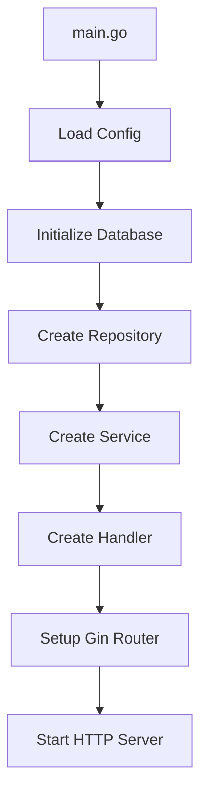
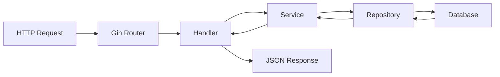

# Go Boilerplate - Architecture Documentation

## Table of Contents
1. [Overview](#overview)
2. [Architecture Pattern](#architecture-pattern)
3. [Project Structure](#project-structure)
4. [Application Flow](#application-flow)
5. [Layer Responsibilities](#layer-responsibilities)
6. [Technology Stack](#technology-stack)
7. [API Endpoints](#api-endpoints)
8. [Development Guidelines](#development-guidelines)
9. [Deployment](#deployment)

## Overview

This Go application is built using the **Clean Architecture** pattern with domain-driven design principles. It provides a scalable foundation for building REST APIs using the Gin framework with PostgreSQL as the database.

### Key Features
- Clean Architecture with clear separation of concerns
- Domain-driven design with modular structure
- RESTful API using Gin framework
- PostgreSQL integration with GORM ORM
- Environment-based configuration
- Docker support for containerization
- Hot reloading support for development

## Architecture Pattern

The application follows **Clean Architecture** principles:

```
┌─────────────────────────────────────────────────────────────┐
│                    External Interfaces                      │
│  ┌─────────────┐  ┌─────────────┐  ┌─────────────────────┐ │
│  │   HTTP/REST │  │  Database   │  │   Config/Env        │ │
│  └─────────────┘  └─────────────┘  └─────────────────────┘ │
└─────────────────────────────────────────────────────────────┘
┌─────────────────────────────────────────────────────────────┐
│                 Interface Adapters                          │
│  ┌─────────────┐  ┌─────────────┐  ┌─────────────────────┐ │
│  │   Handlers  │  │ Repositories│  │   DTOs              │ │
│  └─────────────┘  └─────────────┘  └─────────────────────┘ │
└─────────────────────────────────────────────────────────────┘
┌─────────────────────────────────────────────────────────────┐
│                 Application Business Rules                  │
│                   ┌─────────────┐                          │
│                   │  Services   │                          │
│                   └─────────────┘                          │
└─────────────────────────────────────────────────────────────┘
┌─────────────────────────────────────────────────────────────┐
│                 Enterprise Business Rules                   │
│                     ┌─────────────┐                        │
│                     │   Models    │                        │
│                     └─────────────┘                        │
└─────────────────────────────────────────────────────────────┘
```

### Dependency Flow
Dependencies flow **inward** toward the business logic:
- **Handlers** depend on **Services**
- **Services** depend on **Repositories** (via interfaces)
- **Repositories** depend on **Models**
- **Models** have no dependencies

## Project Structure

```
boiler/
├── cmd/
│   └── server/
│       └── main.go                 # Application entry point
├── config/
│   └── config.go                   # Configuration management
├── internal/                       # Private application code
│   ├── common/                     # Shared utilities
│   │   ├── errors/
│   │   │   └── errors.go          # Custom error types
│   │   ├── middleware/
│   │   │   └── auth.go            # Authentication middleware
│   │   └── utils/
│   │       └── helpers.go         # Utility functions
│   ├── database/
│   │   └── database.go            # Database connection
│   └── user/                      # User domain
│       ├── dto/
│       │   └── user_dto.go        # Data Transfer Objects
│       ├── handler/
│       │   └── user_handler.go    # HTTP handlers
│       ├── model/
│       │   └── user.go            # Domain models
│       ├── repository/
│       │   └── user_repository.go # Data access layer
│       └── service/
│           └── user_service.go    # Business logic
├── pkg/                           # Public libraries
│   └── logger/
│       └── logger.go              # Logging utilities
├── scripts/
│   └── run.sh                     # Helper scripts
├── go.mod                         # Go modules
├── go.sum                         # Dependencies lock file
├── Dockerfile                     # Docker configuration
└── README.md                      # Basic project info
```

### Directory Purposes

#### `cmd/`
Contains application entry points. Each subdirectory represents a different executable.

#### `internal/`
Private application code that cannot be imported by other applications.

#### `pkg/`
Public libraries that can be imported by external applications.

#### `config/`
Configuration management and environment variable handling.

## Application Flow

### Startup Flow


### Request/Response Flow


### Detailed Request Flow (User Creation Example)

1. **HTTP Request**: `POST /users` with JSON payload
2. **Router**: Gin routes to `UserHandler.CreateUser`
3. **Handler Layer**: 
   - Validates and binds JSON to `User` model
   - Calls `UserService.CreateUser()`
4. **Service Layer**: 
   - Applies business logic (validation, rules)
   - Calls `UserRepository.CreateUser()`
5. **Repository Layer**: 
   - Executes database operation via GORM
   - Returns result to service
6. **Response**: Handler returns JSON response with appropriate status code

## Layer Responsibilities

### 1. Models (`internal/*/model/`)
- **Purpose**: Enterprise business rules and entities
- **Responsibilities**:
  - Define domain entities and their properties
  - Contain business rules that are critical to the business
  - Independent of external concerns
- **Example**: `User` struct with business validation

### 2. Services (`internal/*/service/`)
- **Purpose**: Application business rules
- **Responsibilities**:
  - Orchestrate use cases
  - Implement application-specific business logic
  - Coordinate between different repositories
  - Handle transactions and business workflows
- **Example**: User registration workflow, email validation

### 3. Repositories (`internal/*/repository/`)
- **Purpose**: Data access abstraction
- **Responsibilities**:
  - Abstract database operations
  - Implement data persistence
  - Convert between domain models and database schemas
- **Example**: CRUD operations for User entity

### 4. Handlers (`internal/*/handler/`)
- **Purpose**: HTTP interface adapters
- **Responsibilities**:
  - Handle HTTP requests and responses
  - Validate input data
  - Convert between HTTP formats and application types
  - Handle HTTP-specific concerns (status codes, headers)
- **Example**: REST endpoints for user management

### 5. DTOs (`internal/*/dto/`)
- **Purpose**: Data transfer objects
- **Responsibilities**:
  - Define request/response structures
  - Handle data validation
  - Separate external API contracts from internal models
- **Example**: User creation request, user response format

## Technology Stack

### Core Framework
- **Go**: 1.25.1
- **Gin**: 1.11.0 - HTTP web framework
- **GORM**: 1.31.0 - ORM library

### Database
- **PostgreSQL**: Primary database
- **GORM Driver**: `gorm.io/driver/postgres` 1.6.0

### Configuration
- **godotenv**: 1.5.1 - Environment variable management

### Development Tools
- **Air**: Hot reloading during development
- **Docker**: Containerization support

## API Endpoints

### Health Check
```http
GET /ping
```
**Response**:
```json
{
  "message": "pong"
}
```

### User Management

#### Create User
```http
POST /users
Content-Type: application/json

{
  "name": "John Doe",
  "email": "john@example.com"
}
```

**Response** (201 Created):
```json
{
  "ID": 1,
  "CreatedAt": "2025-10-06T10:00:00Z",
  "UpdatedAt": "2025-10-06T10:00:00Z",
  "DeletedAt": null,
  "name": "John Doe",
  "email": "john@example.com"
}
```

#### Get User
```http
GET /users/{id}
```

**Response** (200 OK):
```json
{
  "ID": 1,
  "CreatedAt": "2025-10-06T10:00:00Z",
  "UpdatedAt": "2025-10-06T10:00:00Z",
  "DeletedAt": null,
  "name": "John Doe",
  "email": "john@example.com"
}
```

**Error Response** (404 Not Found):
```json
{
  "error": "user not found"
}
```

## Development Guidelines

### Adding New Domains

1. **Create Domain Structure**:
   ```
   internal/
   └── {domain}/
       ├── dto/
       ├── handler/
       ├── model/
       ├── repository/
       └── service/
   ```

2. **Follow Dependency Injection**:
   ```go
   // In main.go
   repo := repository.NewRepository()
   service := service.NewService(repo)
   handler := handler.NewHandler(service)
   ```

3. **Register Routes**:
   ```go
   domainRoutes := r.Group("/{domain}")
   {
       domainRoutes.POST("/", handler.Create)
       domainRoutes.GET("/:id", handler.Get)
   }
   ```

### Error Handling

- Use consistent error responses
- Implement custom error types in `internal/common/errors/`
- Handle different error scenarios with appropriate HTTP status codes

### Database Migrations

- Use GORM's AutoMigrate for development
- Implement proper migration scripts for production
- Version control your database schema changes

### Testing Strategy

- **Unit Tests**: Test individual functions in isolation
- **Integration Tests**: Test component interactions
- **API Tests**: Test HTTP endpoints end-to-end

## Deployment

### Environment Variables

Create a `.env` file or set environment variables:

```bash
DB_HOST=localhost
DB_PORT=5432
DB_USER=postgres
DB_PASSWORD=password
DB_NAME=your_database
```

### Building

```bash
# Build binary
go build -o my-app cmd/server/main.go

# Run binary
./my-app
```

### Docker Deployment

```bash
# Build Docker image
docker build -t my-app .

# Run container
docker run -p 8080:8080 my-app
```

### Production Considerations

1. **Environment Configuration**: Use proper environment variables
2. **Database Connection Pool**: Configure GORM connection settings
3. **Logging**: Implement structured logging
4. **Monitoring**: Add health checks and metrics
5. **Security**: Implement authentication and authorization middleware
6. **Rate Limiting**: Add rate limiting middleware
7. **CORS**: Configure CORS for web client access

## Future Enhancements

### Planned Features
- [ ] Authentication and authorization middleware
- [ ] Structured logging implementation
- [ ] Custom error handling system
- [ ] Database migration system
- [ ] API documentation (Swagger)
- [ ] Unit and integration tests
- [ ] Monitoring and metrics
- [ ] Rate limiting
- [ ] CORS configuration

### Scalability Considerations
- Implement repository interfaces for testability
- Add caching layer (Redis)
- Database read replicas
- Microservice decomposition
- Event-driven architecture